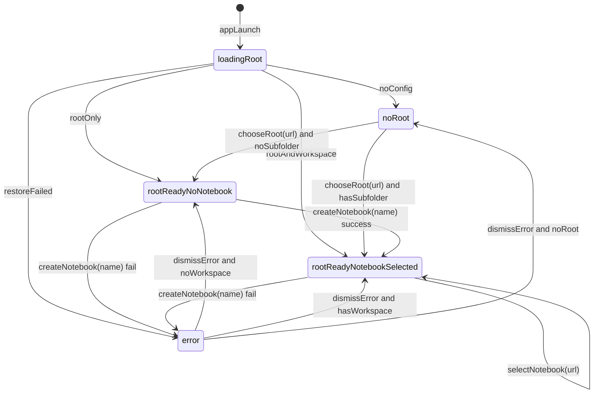

# mnote 状态机（主线）

本文档描述主线状态与事件，作为 UI 代码和状态代码的对齐基准。  
实现对应文件：`mnote/Sources/mnote/LibraryState.swift`、`mnote/Sources/mnote/RootShellView.swift`。

---

## 1. 状态定义

- `noRoot`：未配置 root，无法创建或切换 notebook。
- `loadingRoot`：正在读取或恢复 root 书签与目录数据。
- `rootReadyNoNotebook`：root 已配置，但 `root` 下无子目录。
- `rootReadyNotebookSelected`：root 已配置，且当前有 workspace。
- `error`：最近一次操作失败，弹窗展示提示中（展示后回到原状态）。

---

## 2. 事件定义

- `appLaunch`：应用启动并读取配置。
- `chooseRoot(url)`：用户选择 root 目录。
- `createNotebook(name)`：用户提交新建笔记本。
- `selectNotebook(url)`：用户点击列表切换 notebook。
- `restoreFailed`：配置恢复失败（书签失效、目录不可读等）。
- `dismissError`：用户关闭错误弹窗。

---

## 3. 状态迁移图

---

## 4. 迁移副作用

- `chooseRoot(url)`
  - 写 root 书签到 `~/.mnote/config.json`
  - 清空 workspace 书签
  - 扫描 `root` 子目录并应用默认选择

- `createNotebook(name)` 成功
  - 创建目录 `root/<name>`
  - 刷新 notebook 列表
  - 自动 `selectNotebook(newUrl)`

- `selectNotebook(url)`
  - 校验 `url` 在 `root` 下
  - 更新当前 `workspaceURL`
  - 写 workspace 书签到配置

- `createNotebook(name)` 失败
  - 写入 `userMessage`
  - 触发弹窗展示

---

## 5. 代码约束

- UI 层只派发事件，不直接读写配置文件。
- 状态层（`LibraryState`）负责：
  - 文件系统操作；
  - 配置持久化；
  - 状态发布与错误消息。
- 任何新增交互，先补本文件状态与事件，再改代码。
